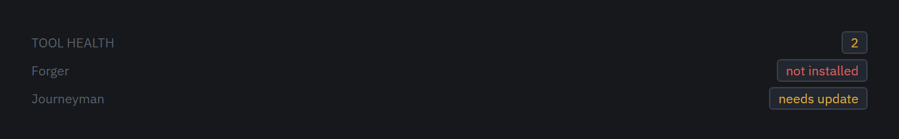

<div align="center">


# HELVE-ADE

**An Agentic Development Environment for building games.**

One window. Your tools, your terminals, your repository, and your coding agent,
all in the same frame.

[](https://github.com/Firelight-Innovations/HELVE-ADE/actions/workflows/verify.yml)
[](LICENSE)
[](#install)
[](#what-works-today)

[Tutorials](docs/user/tutorials/README.md) &middot;
[User docs](docs/user/README.md) &middot;
[Developer docs](docs/dev/README.md) &middot;
[Discussions](https://github.com/Firelight-Innovations/HELVE-ADE/discussions)

</div>

---

## What HELVE is

HELVE is one shell that separate authoring tools mount into. VS Code is one
shell that extensions mount into, and HELVE works the same way. The difference
is the starting assumption. HELVE is built around working next to a coding
agent, not around bolting one on later.

This repository holds the **orchestrator**, which is the window itself. The
orchestrator loads your tools, holds the shared code they run on, and gets the
stack running.

HELVE is a development tool. HELVE does not ship with games built on it.

## The window

Five bands stack in a column. Only the middle one grows.


Every tutorial uses these names, so they are worth four minutes.
[The HELVE window](docs/user/tutorials/the-window.md) walks through each one.

## What works today

The window runs. Its own apps run inside it: Home, the File Explorer, the File
Viewer, and Tutorials. Rust answers all of them.

### Panes and clusters

A **cluster** is one workspace, with its own project and its own arrangement of
panes. Split a pane and the app beside it keeps working.


Clusters sit along the switcher bar. Switching clusters swaps the panes and the
terminals under them together.

### Terminals

The terminal band runs the full width, under your panes. Ctrl and the key under
Escape opens and closes it.


Terminals belong to the cluster, not to the window. Switch clusters and the band
swaps with everything else.

### Search

`Ctrl+K` searches the open project. Results, the file they came from, and a
preview sit on one screen.


### Source control

The panel on the right shows the branch, what is staged, and what is not. A box
underneath takes the commit message. `Ctrl+B` collapses the panel and brings it
back.


Worktrees are there too, so a second branch does not cost a second clone.

### MCP servers for your agent

HELVE hosts MCP servers and writes them into `.mcp.json` for you. Turn one on,
and your coding agent can call it.


[The MCP server manager](docs/mcp-server-manager.md) says which servers exist
and what earns a new one.

### Open with HELVE

Right-click a folder in Explorer and open it as a project. Right-click a file
and it opens in the File Viewer, with its folder as the project.

A second right-click while HELVE is running goes to the window that is already
open. HELVE runs as one process, so two windows can never disagree about your
layout.

### Settings

Every setting is generated from one schema, so a row you can see is a value
something reads.


## What does not work yet

HELVE is **pre-alpha**, and the honest list is short.

- **The stack tools are not integrated.** Forger and Journeyman are placeholder
  repositories. A tool's core is a child process, and the broker that reaches
  it is not built. The switcher shows the orchestrator's own apps only.
- **Nothing is signed.** Windows SmartScreen warns about the installer, and
  you have to click through it.
- **Windows only.** macOS and Linux are untested, not excluded. Nothing in the
  design is Windows-only in principle. No machine here runs them.
- **Some menu items do nothing.** The command palette, the **Run** menu and the
  four **Help** items are drawn already. The shape of the menu is settled, but
  none of those items acts yet.

## Install

**[Download HELVE for Windows](https://github.com/Firelight-Innovations/HELVE-ADE/releases/latest/download/HELVE-setup.exe)**

Run the installer. The wizard never asks for administrator rights and installs
for your account only. HELVE also fetches the WebView2 runtime for you if your
machine does not already have it.

> **Windows will warn you, and you can go ahead.** The installer is not signed,
> so SmartScreen shows "Windows protected your PC" and hides the button. Click
> **More info**, then **Run anyway**. A signing certificate costs money that a
> pre-alpha does not yet justify. [Releases and
> updates](docs/dev/releases.md#what-still-does-not-exist) explains what
> signing would and would not fix.

After installing, right-click any folder in Explorer and choose **Open with
HELVE** to open it as a project. The same entry appears on files, which open in
the File Viewer with their folder as the project.

**One thing will look broken, and is not.** An installed HELVE cannot find a
stack yet, so every tool reads `not installed`. Run from a source checkout to
see one resolve. [The stack, end to end](docs/user/tutorials/the-stack.md)
explains why.

## Build from source

Every prerequisite is a Windows prerequisite, and each one is a one-time step.

- **Rust** (stable): `winget install Rustlang.Rustup`
- **MSVC build tools**: Visual Studio Build Tools 2022, with the *Desktop
  development with C++* workload. Rust uses the MSVC linker on Windows.
- **WebView2 runtime**: already on Windows 11.
- **Node 20+** and **pnpm**: `npm i -g pnpm`

Then:

```sh
git clone https://github.com/Firelight-Innovations/HELVE-ADE.git
cd HELVE-ADE
pnpm install
pnpm app
```

The first `pnpm app` compiles the whole Rust dependency tree, which takes
several minutes. Later runs are fast.

## Learn your way around

[Ten short tutorials](docs/user/tutorials/README.md) cover the window, panes and
clusters, files, search, terminals, git, MCP servers and settings. HELVE ships
the same ten pages in its own Tutorials app. Read them beside the thing they
describe.

Start with [The HELVE window](docs/user/tutorials/the-window.md).

## The stack

HELVE is **multi-repo** on purpose. Each tool is its own repository, and
`helve.toml` pins the exact version of each one this orchestrator expects.

| Repository | What it is | Status |
|---|---|---|
| [helve-forger](https://github.com/Firelight-Innovations/helve-forger) | Technical design software. Specs out the stack and its boundaries. | Placeholder, README only |
| [helve-journeyman](https://github.com/Firelight-Innovations/helve-journeyman) | Game design software. Design prototyping and rough playable systems. | Placeholder, README only |



**Only this repository has code in it today.** The other two are a `v0.1.0` tag
against a README. That tag is what `helve.toml` pins, which is why HELVE reports
them as `unversioned` rather than matching. The pin holds a shape, not a
release.

On a fresh machine every tool reads **not installed**. That reading is correct,
not broken. [The stack, end to end](docs/user/tutorials/the-stack.md) explains
why.

## Contributing

Pull requests are welcome. Read **[CONTRIBUTING.md](CONTRIBUTING.md)** before
your first one. The guide covers getting a build, the four checks every pull
request must pass, and what will not be accepted.

Then read the **[developer docs](docs/dev/README.md)**. Those pages map the
technical material:

- [How the orchestrator is built](docs/dev/architecture.md)
- [The rule book](STANDARDS.md)
- [The tool protocol](docs/tool-protocol.md)
- [What exists around releases](docs/dev/releases.md)

The maintainer builds three pieces directly: the app download system, Forger,
and Journeyman. The reason is not a closed door. Nobody should spend a weekend
on a foundation that is already half-written. Features and quality-of-life work on
top of those three is where an outside change lands best. A roadmap and a set of
starter issues are coming to say where.

Found a bug, or want something that is not here? Open an issue. Want to talk
about it first? Open a
[discussion](https://github.com/Firelight-Innovations/HELVE-ADE/discussions).

## License

HELVE is Apache-2.0. [LICENSE](LICENSE) has the full text, and
[NOTICE](NOTICE) is the file a redistributor carries with it.

Apache rather than MIT, because of the patent grant. Third-party tools load into
this shell through the tool protocol, and MIT says nothing about patents at all.
Not GPL or AGPL under any circumstances. A copyleft core hands someone a real
argument that the private tools mounting into it are derivative works.

The license covers the code and not the names. HELVE, Forger and Journeyman, and
the marks that go with them, are trademarks of Firelight Innovations.

Fork this, sell what you build on it, and say plainly that your work is based on
HELVE. All of that is fine. Shipping it *as* HELVE is not. Once the source is
freely copyable, the name is the last thing left. The name is what tells a user
which build runs tools on their machine.
