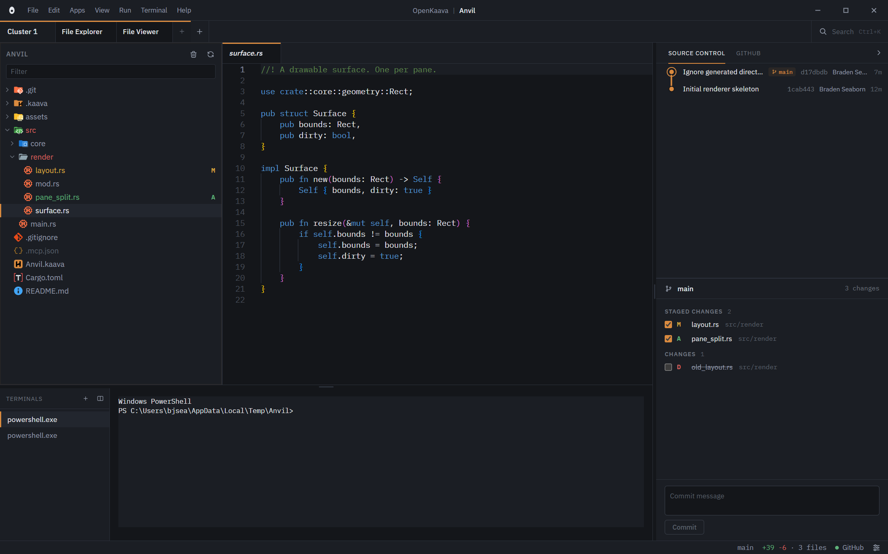
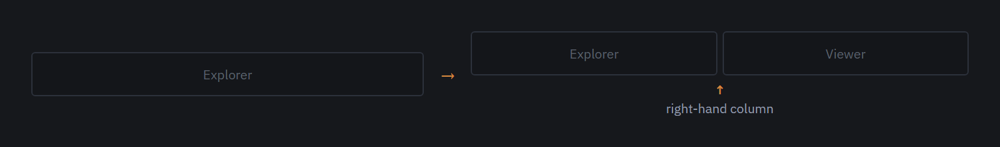
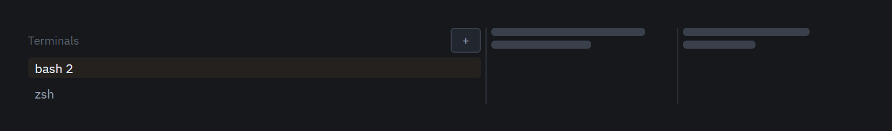
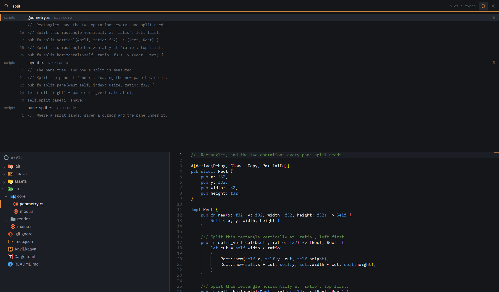
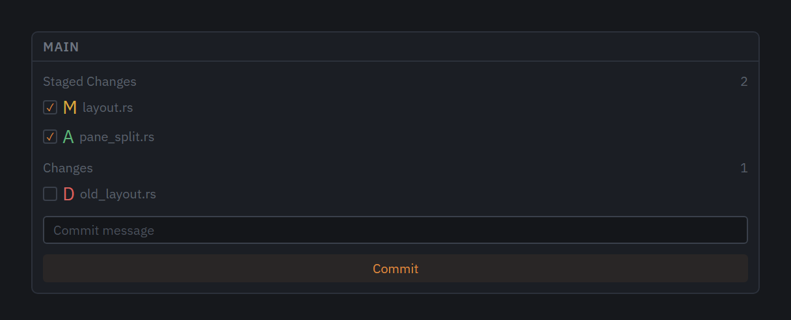
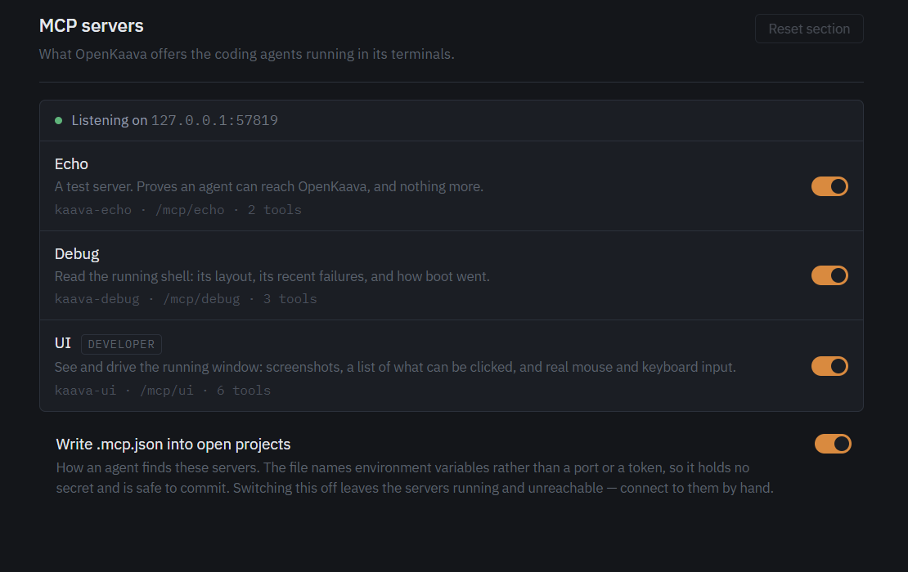
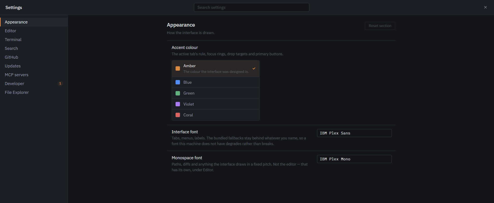

<div align="center">


# HELVE-ADE

<p>
  <strong>An Agentic Development Environment (ADE).</strong><br/>
  One window for your tools, your terminal, your files, and your coding agent.
</p>

<p>
  <a href="https://github.com/Firelight-Innovations/HELVE-ADE/actions/workflows/verify.yml"></a>
  <a href="https://github.com/Firelight-Innovations/HELVE-ADE/stargazers"></a>
  <a href="LICENSE"></a>
  
  <a href="#what-works-today"></a>
</p>

<p>
  <a href="docs/user/tutorials/README.md"><ins>Tutorials</ins></a> &middot;
  <a href="docs/user/README.md"><ins>User docs</ins></a> &middot;
  <a href="docs/dev/README.md"><ins>Developer docs</ins></a> &middot;
  <a href="https://github.com/Firelight-Innovations/HELVE-ADE/discussions"><ins>Discussions</ins></a>
</p>

</div>

---

## What HELVE is

HELVE is an Agentic Development Environment, or ADE. An ADE is a desktop app.
It holds your development tools in one window. It also holds a coding agent
that works alongside you.

VS Code works in a similar way. VS Code is a code editor. Extensions add tools
to VS Code. HELVE works the same way: tools mount into HELVE.

HELVE makes one assumption that VS Code does not. HELVE assumes you work next
to a coding agent from the start.

This repository holds the orchestrator. The orchestrator is the main window
itself. It loads your tools. It also runs the code that your tools share.

HELVE is a development tool. It does not run the software that you build with
it.

## What makes HELVE different

Most tools bolt a coding agent onto an existing code editor. HELVE takes a
different approach: it keeps design and code in one place.

<table>
<tr>
<td>

Two design tools mount into HELVE.

**A product design tool.** Use it to write a product requirements document, or
PRD. A PRD describes what to build and why.

**A technical design tool.** Use it to turn the PRD into a technical design. A
technical design specifies the architecture, the interfaces, and the
boundaries between systems.

A team of coding agents reads both documents and builds the software. The
agents work inside an environment that enforces strict code quality rules.

HELVE traces every step. The trace starts at the PRD. It runs through the
technical design, the code, the tests, and the build. You can follow any line
of code back to the decision that produced it.

This traceability is the idea that sets HELVE apart from other development
environments.

**Forger** builds the technical design tool. **Journeyman** builds the product
design tool. Both ship as apps inside this repository rather than as separate
downloads — see [`apps/README.md`](apps/README.md) — and neither is built yet.
[What does not work yet](#what-does-not-work-yet) has the full list.

</td>
</tr>
</table>

## The window

HELVE has one main window. The window has five bands. The bands stack in a
column. Only the middle band grows or shrinks. The other four bands stay a
fixed height.



[The HELVE window](docs/user/tutorials/the-window.md) tutorial explains each
band. Read it first. Every other tutorial uses these five names.

## What works today

The window runs. Its own tools run inside it: Home, the File Explorer, the
File Viewer, and Tutorials. Rust answers all of them.

<table>
<tr>
<td width="50%" valign="middle">

### Panes and clusters

A cluster is one workspace. Each cluster has its own project and its own
arrangement of panes. Split a pane. The tool beside it keeps working.

Clusters sit along the switcher bar. Switch clusters. The panes and the
terminals under them swap together.

</td>
<td width="50%">
  
</td>
</tr>
<tr>
<td width="50%" valign="middle">

### Terminals

The terminal band runs the full width, under your panes. Press Ctrl and the
key under Escape to open and close it.

Terminals belong to the cluster, not to the window. Switch clusters. The
terminal band swaps with everything else.

</td>
<td width="50%">
  
</td>
</tr>
<tr>
<td width="50%" valign="middle">

### Search

Press `Ctrl+K` to search the open project. The results, the file each result
came from, and a preview all sit on one screen.

</td>
<td width="50%">
  
</td>
</tr>
<tr>
<td width="50%" valign="middle">

### Source control

The panel on the right shows your branch, your staged changes, and your
unstaged changes. A box below takes your commit message. Press `Ctrl+B` to
collapse the panel and bring it back.

Git worktrees are here too. A second branch does not need a second clone.

</td>
<td width="50%">
  
</td>
</tr>
<tr>
<td width="50%" valign="middle">

### MCP servers for your agent

MCP stands for Model Context Protocol. MCP lets your coding agent call
external tools. HELVE hosts MCP servers for you. It writes each one into
`.mcp.json`. Turn on a server. Your coding agent can then call it.

[The MCP server manager](docs/mcp-server-manager.md) explains which servers
exist and when a new one is worth adding.

</td>
<td width="50%">
  
</td>
</tr>
<tr>
<td colspan="2">

### Open with HELVE

Right-click a folder in Explorer and open it as a project. Right-click a file
and it opens in the File Viewer, with its folder as the project.

A second right-click while HELVE is running goes to the window that is already
open. HELVE runs as one process, so two windows can never disagree about your
layout.

</td>
</tr>
<tr>
<td width="50%" valign="middle">

### Settings

HELVE generates every setting from one schema. A row you can see is a value
that something reads.

</td>
<td width="50%">
  
</td>
</tr>
</table>

## What does not work yet

HELVE is pre-alpha. The honest list is short.

- **The design tools are not built yet.** Forger and Journeyman are apps that
  live in this repository (see [`apps/README.md`](apps/README.md)) and neither
  has a working screen behind it yet. The switcher bar shows only the
  orchestrator's other apps in the meantime.
- **Nothing is signed.** Windows SmartScreen warns about the installer. You
  have to click through it.
- **Windows only.** macOS and Linux are untested, not excluded. Nothing in the
  design is Windows-only. No machine here runs them yet.
- **Some menu items do nothing.** The command palette, the Run menu, and four
  of the five Help items already exist. The shape of the menu is settled. None
  of those items acts yet. Help ▸ Check for Updates is the exception and is
  wired — see `docs/dev/releases.md`.

## Install

**[Download HELVE for Windows](https://github.com/Firelight-Innovations/HELVE-ADE/releases/latest/download/HELVE-setup.exe)**

Run the installer. It does not ask for administrator rights. It installs for
your account only. HELVE also fetches the WebView2 runtime for you, if your
machine does not already have it.

> **Windows will warn you. You can go ahead.** The installer is not signed.
> SmartScreen shows "Windows protected your PC" and hides the button. Click
> **More info**, then **Run anyway**. A signing certificate costs money that a
> pre-alpha does not yet justify. [Releases and
> updates](docs/dev/releases.md#what-still-does-not-exist) explains what
> signing would and would not fix.

After installing, right-click any folder in Explorer and choose **Open with
HELVE**. HELVE opens the folder as a project. The same entry appears on files.
A file opens in the File Viewer, with its folder as the project.

## Build from source

Use this option to build HELVE yourself, or to contribute code to it.

Every prerequisite below is a Windows prerequisite. Install each one once.

- **Rust** (stable): `winget install Rustlang.Rustup`
- **MSVC build tools**: install Visual Studio Build Tools 2022. Choose the
  *Desktop development with C++* workload. Rust needs the MSVC linker on
  Windows.
- **WebView2 runtime**: Windows 11 already has this.
- **Node 20+** and **pnpm**: run `npm i -g pnpm`.

Then run:

```sh
git clone https://github.com/Firelight-Innovations/HELVE-ADE.git
cd HELVE-ADE
pnpm install
pnpm app
```

The first `pnpm app` command compiles the whole Rust dependency tree. This
step takes several minutes. Later runs are fast.

## Learn your way around

[Ten short tutorials](docs/user/tutorials/README.md) cover the window, panes
and clusters, files, search, terminals, git, MCP servers, and settings. HELVE
ships the same ten pages in its own Tutorials tool. Read each tutorial beside
the thing it describes.

Start with [The HELVE window](docs/user/tutorials/the-window.md).

## The stack

HELVE is multi-repo by design: a tool with its own repository, its own release
cadence, and its own checkout beside this one, pinned to an exact version in
`helve.toml`. That stays the model for a genuinely third-party tool — it is why
`helve.toml` and `catalog.toml` both keep working with zero rows rather than
being deleted (see their headers).

Forger and Journeyman are not that kind of tool, though. Both live in this
repository, under `apps/`, and ship in the same binary as Home and the File
Explorer rather than as a separate checkout — see
[`apps/README.md`](apps/README.md) for what that distinction means. That
leaves `helve.toml`'s `[[tool]]` array empty today: there is nothing pinned,
and nothing for the switcher bar's health badge to report on, which is the
badge's normal silent state rather than a sign that something failed to load.
[The stack, end to end](docs/user/tutorials/the-stack.md) is what that badge
means and how to read it once something is pinned there again.

## Contributing

Pull requests are welcome. Read [CONTRIBUTING.md](CONTRIBUTING.md) first. It
explains how to get a build running, the four checks every pull request must
pass, and what we will not accept.

Then read the [developer docs](docs/dev/README.md). These pages cover the
technical details:

- [How the orchestrator is built](docs/dev/architecture.md)
- [The rule book](STANDARDS.md)
- [The tool protocol](docs/tool-protocol.md)
- [What exists around releases](docs/dev/releases.md)

The maintainer builds three pieces directly: the app download system, Forger,
and Journeyman. This is not a closed door. Nobody should spend a weekend on a
foundation that already has an owner. Outside contributions fit best as
features and quality-of-life work on top of those three pieces. A roadmap and
a set of starter issues are coming. They will point to exactly where.

Found a bug? Open an issue. Want something that is not here? Open an issue
too. Want to talk about an idea first? Open a
[discussion](https://github.com/Firelight-Innovations/HELVE-ADE/discussions).

## License

HELVE uses the Apache-2.0 license. [LICENSE](LICENSE) has the full text.
[NOTICE](NOTICE) is the file that a redistributor must carry with it.

HELVE uses Apache, not MIT, because of the patent grant. Third-party tools
load into HELVE through the tool protocol. MIT says nothing about patents.
HELVE does not use GPL or AGPL, under any circumstances. A copyleft license
would give someone a real argument that private tools mounting into HELVE are
derivative works.

The license covers the code. It does not cover the names. HELVE, Forger, and
Journeyman, and the marks that go with them, are trademarks of Firelight
Innovations.

You can fork HELVE. You can sell what you build on it. State plainly that your
work is based on HELVE. All of that is fine.

Do not ship your fork as HELVE itself. The code is free to copy. The name is
not. The name tells a user which build runs the tools on their machine.
